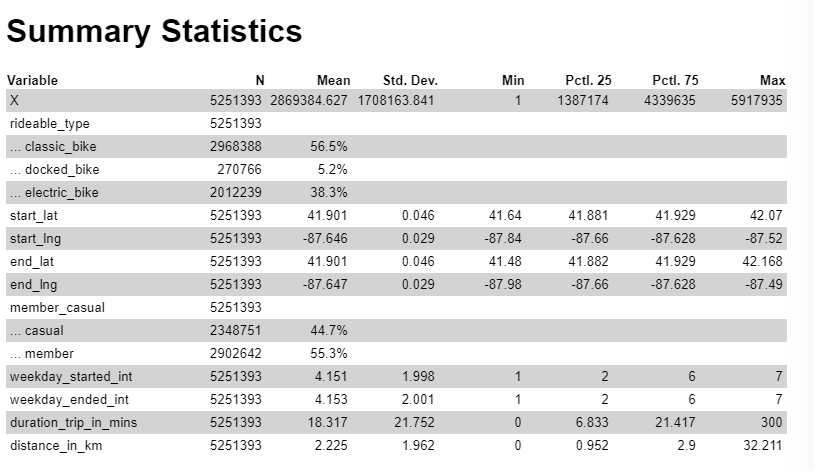
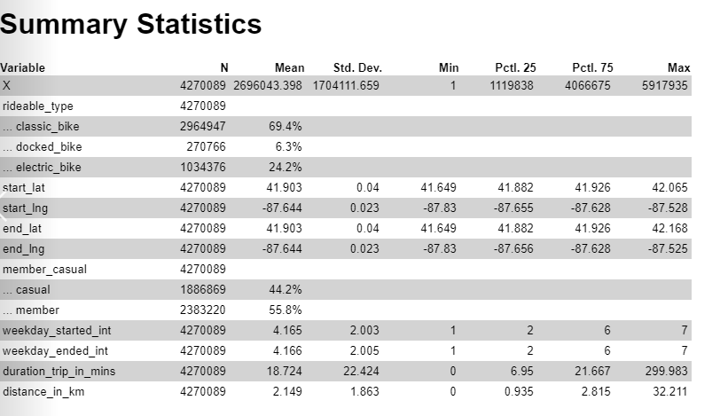

---
output:
  html_document: default
  pdf_document: default
---
# Journal data collection, validation and cleaning

### *Data collection* 

#### Downloaded the data from https://divvy-tripdata.s3.amazonaws.com/index.html
#### Due to some of the files being greater in size than 100MB, I used a GNU General Public License version 3.0 (GPLv3) "Free Huge CSV Splitter" software to create files all lesser than 100 MB. 

#### *Data Processing*

#### I have obtained 17 files in total, I use the below script in python to add the headers on the split files, the split files withouth headers ended with a 'II' notation: 

> *import pandas as pd*<br>
> *import os*
> *directory = './no_names/'*
> *tester = pd.read_csv('TESTER.csv')*
>
> *names = list(tester.columns)*<br>
> *for filname in os.listdir(directory):*<br>
>
>> *temp = str(filname)*<br>
>> *df = pd.read_csv(directory + str(filname))*<br>
>> *df.columns = names*<br>
>> *df.to_csv('headed_{}'.format(temp), index = False)*<br>

#### I have uploaded the csv files to a BigQuery Project. I have executed a Query to do "Union ALL" of the tables and store the result in a csv file, selecting the option for not limit in size on the save file 

> SELECT * FROM `tidal-tower-348213.Trips_data.data_2021_04` UNION ALL
> SELECT * FROM `tidal-tower-348213.Trips_data.data_2021_05` UNION ALL
> SELECT * FROM `tidal-tower-348213.Trips_data.data_2021_06_I` UNION ALL
> SELECT * FROM `tidal-tower-348213.Trips_data.data_2021_06_II` UNION ALL
> SELECT * FROM `tidal-tower-348213.Trips_data.data_2021_07_I` UNION ALL
> SELECT * FROM `tidal-tower-348213.Trips_data.data_2021_07_II` UNION ALL
> SELECT * FROM `tidal-tower-348213.Trips_data.data_2021_08_I` UNION ALL
> SELECT * FROM `tidal-tower-348213.Trips_data.data_2021_08_II` UNION ALL
> SELECT * FROM `tidal-tower-348213.Trips_data.data_2021_09_I` UNION ALL
> SELECT * FROM `tidal-tower-348213.Trips_data.data_2021_09_II` UNION ALL
> SELECT * FROM `tidal-tower-348213.Trips_data.data_2021_10_I` UNION ALL
> SELECT * FROM `tidal-tower-348213.Trips_data.data_2021_10_II` UNION ALL
> SELECT * FROM `tidal-tower-348213.Trips_data.data_2021_11` UNION ALL
> SELECT * FROM `tidal-tower-348213.Trips_data.data_2021_12` UNION ALL
> SELECT * FROM `tidal-tower-348213.Trips_data.data_2022_01` UNION ALL
> SELECT * FROM `tidal-tower-348213.Trips_data.data_2022_02` UNION ALL
> SELECT * FROM `tidal-tower-348213.Trips_data.data_2022_03`

### Data Cleaning in R

#### Let's start by loading the library and installing packages, and then to load the data stored on the .CSV file on the above query. 

```{r}
# install.packages('geosphere')
# install.packages('matrixStats')
# install.packages('dplyr')
# install.packages('plyr')
# install.packages('vtable')
# 
# library(tidyverse)
# library(geosphere)
# library(matrixStats)
# data <- read.csv("data_12_months.csv")
```


#### Eliminated duplicated rows: Dataframe rows count down from 5,917,935 to 5,386,302.
#### Eliminated rows with no "end coordinates":  rows down from 5,386,302 to 5,381,853.

```{r}
# data <- data %>%
#   distinct(ride_id, .keep_all = TRUE) %>%                       
#   drop_na(end_lat)        
 
```

#### Extracted date and time for start and end in different columns, remove started_at and ended_at columns, Added a column with weekday both numeric (Monday = 1, etc) and abreviated as a string

```{r}
#extract date and time in separate columns at start and end
# data$start_time<- format(as.POSIXct(                          
# data$started_at),format = "%H:%M:%S")
# data$start_date <- as.Date (data$started_at)
# 
# data$end_time<- format(as.POSIXct(
# data$ended_at),format = "%H:%M:%S")
# data$end_date <- as.Date (data$ended_at)
# 
# #add the day of the week                                                                                         
# data$weekday_started = format(data$start_date, format = "%a")                                #*as a string abbreviated
# data$weekday_started_int = as.numeric(format(data$start_date, format = "%u"))                #* as an integer, Monday = 1   
# data$weekday_ended = format(data$end_date, format = "%a") 
# data$weekday_ended_int = as.numeric(format(data$end_date, format = "%u"))                    #idem
# 
# #calculate duration
# data$duration_trip_in_mins <- difftime(data$ended_at, data$started_at, units = "mins") #let's check some stats
# mean(data$duration_trip_in_mins)
# max(data$duration_trip_in_mins)
# min(data$duration_trip_in_mins)
# 
# #removed the date columns with combination of day and time
# data <- subset(data, select = -c(started_at, ended_at))   
```
#### It is observable that the data duration seems to have outliers, some negative differences and values that are not coherent in terms of trip duration for this kind of servcie, this woudl be process later on to make sure the data is clean and consistent. 

#### Creation of the 'haversine' function, to calculate the distances in Km between two points given by their geographical coordinates. 

```{r}
# haversine<- function(long1, lat1, long2, lat2) {
#   
#   stopifnot(is.numeric(long1),
#             is.numeric(lat1),
#             is.numeric(long2),
#             is.numeric(lat2),
#             long1 > -180,
#             long1 < 180,
#             lat1 > -180,
#             lat1 < 180,
#             long2 > -180,
#             long2 < 180,
#             lat2 > -180,
#             lat2 < 180
#   )
#   
#   long1 <- long1*pi/180
#   lat1 <- lat1*pi/180
#   long2 <- long2*pi/180
#   lat2 <- lat2*pi/180
#   
#   R <- 6371 # Earth mean radius [km]
#   delta.long <- (long2 - long1)
#   delta.lat <- (lat2 - lat1)
#   a <- sin(delta.lat/2)^2 + cos(lat1) * cos(lat2) * sin(delta.long/2)^2
#   c <- 2 * asin(min(1,sqrt(a)))
#   d = R * c
#   return(d) # Distance in km
# }

```

#### Adding a column for distance in km per trip. 
```{r}
# data$distance_in_km <- with(data, mapply(haversine, lat1=data$start_lat, long1=data$start_lng, lat2=data$end_lat, long2=data$end_lng))
```

#### Let's summarise the numerical variables to explore for outliers, based on this, lets filtter the data to observe this outliers. 
```{r}
# data %>% summarise_if(is.numeric, max)
# data %>%summarise_if(is.numeric, min)
# 
# outliers_distance_max <- data %>% filter(distance_in_km > 1000)
# outliers_distance_and_duration <- data %>% filter(distance_in_km == 0 & duration_trip_in_mins < 5)# we will remove the trips that the bike is docked in the same station and less than 5 min have passed. Candidate to abandon trip.
# Outlier_graph <-data %>% filter(ride_id == "9F438AD0AB380E3F" )  #ride id detected as an outlier on Tableau when checking end lat and lng.
# outlier_time_more_than_5_hrs <- data %>% filter(duration_trip_in_mins > 300)  #check trip duration greater than 5 hours
# outlier_time_null_time_or_negative <- data %>% filter(duration_trip_in_mins < 0 ) # check negative duration 

```


#### Removal of outliers
```{r}
# #Removal of the correspondent rows for the outliers
# data <- subset(data, distance_in_km != 0 | duration_trip_in_mins > 4)     #removal of 131855 rows
# data <- subset(data, distance_in_km < 1000)  #distance more than 1000KM, tested max and it went down to 114.3836
# data <- subset(data, duration_trip_in_mins <= 300 & duration_trip_in_mins >=0) #removal of  9419 rows with more of 5 hours duration, 1161 of them more than a day.
# data <- subset(data, ride_id != "9F438AD0AB380E3F")
```

#### After observing the rows with NaN values on the end or start station data, it was detected that about 13% of the data was affected, at this point I analysed the difference between indicators after and before of the drop of these NaN, the conlcusion was that the drop of this info only affected statistically the data in terms of the type of bike used, which is not a variable relevant for this study, therefore I decided to drop the NaN values. 


 


#### Remove NaN - this would reduce the data by 13%, but as it is shonw above, this does not introduce bias on the data apart from the proportion of the different type of bikes, which is not an issue on this process. 
```{r}
# data_no_NaN <- na.omit(data)
```

#### Convert trip duration to float. 
```{r}
# data_no_NaN$duration_trip_in_mins <- as.numeric(data_no_NaN$duration_trip_in_mins)
# data$duration_trip_in_mins <- as.numeric(data$duration_trip_in_mins)
```

#### Let's check the stats after and before the drop of the NaN
```{r}
# st(data)
# st(data_no_NaN)
```

#### Finally, let's save the clean data. 
```{r}
# write.csv(data_no_NaN,"D:\\data_clean_final.csv", row.names = FALSE)
```

### Appendix

```{r}
#Check for NAN values across columns. 
# apply(X = is.na(data_no_NaN), MARGIN = 2, FUN = sum)


#Shows the MAX of any numerical column, it is detected the outlier potentially observed on Tableau
# data %>% summarise_if(is.numeric, max)
# data %>%summarise_if(is.numeric, min)
# max(data$duration_trip_in_mins)
# min(data$duration_trip_in_mins)
```

